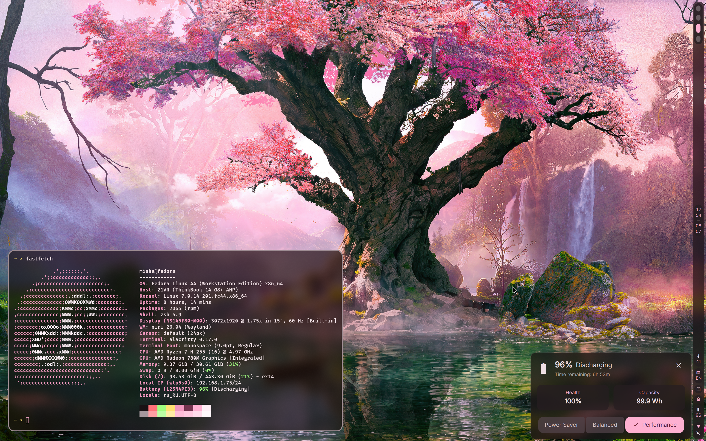
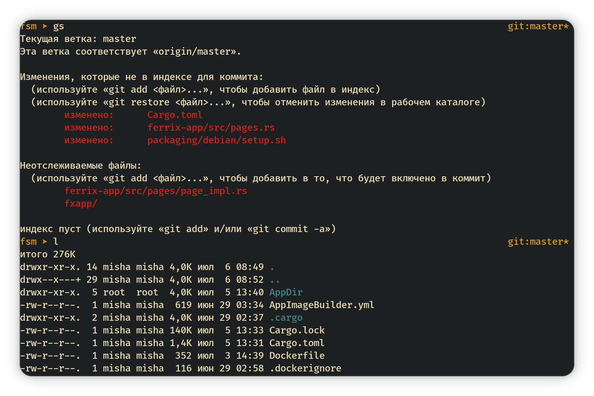

# my dotfiles



- **Laptop 1:** Lenovo ThinkBook 14+ 2026 (14 G8+ AHP):
  - AMD Ryzen 7 H 255;
  - AMD Radeon 780M;
  - 32 Gb LPDDR5x 7500 MT/s;
  - 1 Tb PCIe 4.0 x4 NVMe SSD;
  - 3072x1920 IPS 120 Hz;
  - **Distro:** Fedora 44 Workstation and Windows 11 (OEM);
- **Laptop 2:** Lenovo ideapad 530s-14ARR (81H1):
  - AMD Ryzen 5 2500U;
  - AMD Radeon Vega 8;
  - 16 Gb LPDDR4 2400 MT/s;
  - 256 PCIe 3.0 x2 NVMe SSD;
  - 1920x1080 IPS 60 Hz;
  - **Distro:** Fedora 44 Workstation;
- **Laptop 3:** Samsung NF210:
  - Intel Atom N455;
  - 1 Gb DDR2 (DDR3?);
  - 60 Gb SATA3 5400RPM HDD;
  - 1024x600 TN 60 Hz;
  - **System:** Windows XP SP3 x86;
- **Desktop:** GNOME 50 and DankMaterialShell with Niri compositor;
- **Cmd shell:** `zsh`;
- **Monospace Font:** FiraCode Medium 9px;
- **Terminal:** Alacritty or BlackBox;
- **Browser:** Firefox;
- **Editor:** Helix;

## zsh config



I use OhMyZSH with the `arrow` theme.

**Aliases:**

```bash
alias gs="git status"
alias gp="git push"
alias gpm="git push mirror"
alias gc="git commit"
alias open="xdg-open"
alias cls="clear"
```

## niri et al. config

DankMaterialShell with my small changes:

- Alacritty config: `.config/alacritty/` (FiraCode font is required);
- Niri config: `.config/niri/`;
- DankMaterialShell config: `.config/DankMaterialShell/`

## helix config

- My config for editor;
- Custom LSP config;
- `gruvbox` theme from old helix versions;

## qt5, qt6 setup

- `.config/qt5ct` for Qt5 (needs `qt5ct` package);
- `.config/qt6ct` for Qt6 (needs `qt6ct` package);
